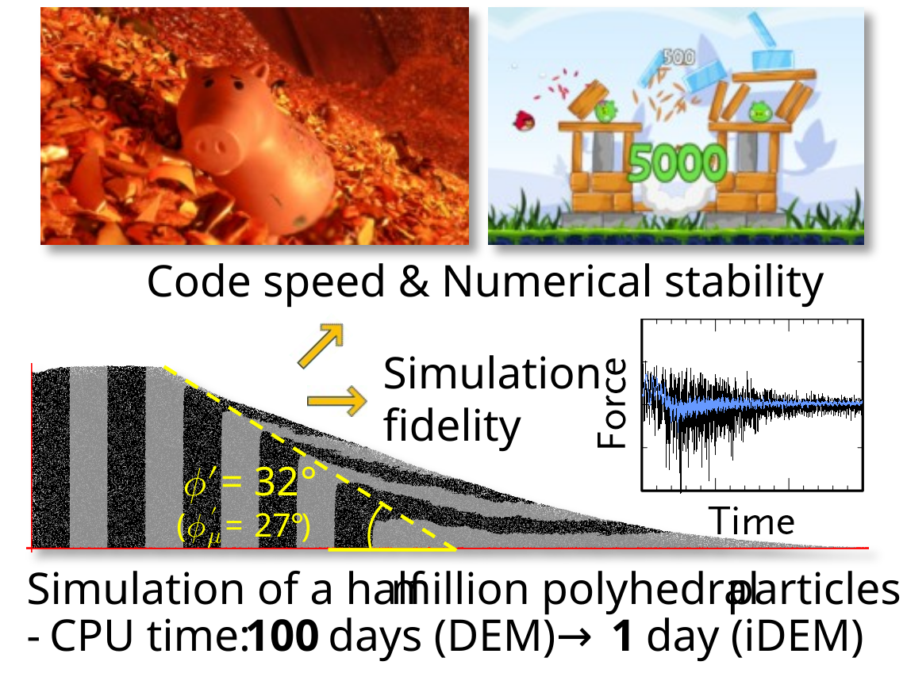
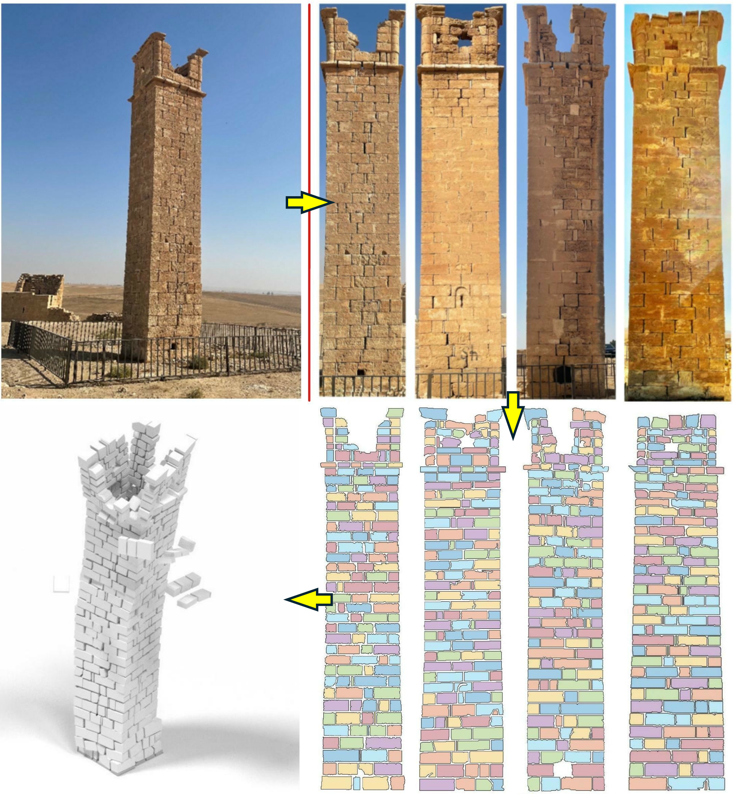

## **Selected Publications**

**iDEM: An impulse-based discrete element method for fast granular dynamics**\
[https://doi.org/10.1002/nme.4923](https://doi.org/10.1002/nme.4923)\
This work introduces an impulse-based discrete element method (iDEM) for efficient simulation of granular materials. By replacing contact-force calculations with collision impulses and directly updating particle velocities, the method bypasses acceleration integration while preserving fidelity. The approach is numerically stable and achieves speedups approaching two orders of magnitude over conventional DEM, enabling large-scale simulations on accessible computing hardware.

**Image-based 3D modeling-to-simulation of single-wythe masonry structure via reverse descriptive geometry**\
[https://doi.org/10.1016/j.jobe.2023.107125](https://doi.org/10.1016/j.jobe.2023.107125)\
This study develops an image-based 3D modeling-to-simulation framework for rapid vulnerability assessment of single-wythe masonry structures. Using reverse descriptive geometry, 2D wall images are transformed into 3D discrete element models for seismic analysis. The framework combines automated geometry reconstruction, impulse-based dynamic simulation, and high-fidelity masonry modeling to enable efficient, accurate, and computationally scalable hazard assessment.

---

## **Sponsored Projects**


**BRITE Pivot: DEMIAN - Discrete Element Method Infused with Artificial Neural computations**\
[Sponsor: National Science Foundation (PI: Seung Jae Lee)](https://www.nsf.gov/awardsearch/show-award?AWD_ID=2527265)\
This project develops DEMIAN (Discrete Element Method Infused with Artificial Neural computations), a next-generation discrete element simulation framework that integrates AI-driven computations to enable real-time, high-fidelity simulation of granular materials at unprecedented scale.



**QUAD: Quantum Computing-Accelerated Discrete Element Method**\
[Sponsor: FIU Office of the Provost (PI: Seung Jae Lee)](https://provost.fiu.edu/)\
This project aims to develop QUAD, a quantum computing-accelerated discrete element method for simulating granular materials. By reformulating DEM computational bottlenecks to exploit quantum computing, the project seeks to dramatically accelerate large-scale particle simulations beyond the limits of conventional and high-performance computing, enabling transformative advances in granular mechanics, hazard prediction, and engineering design.


{{< research-captioned-entry image="opportunity-wheel.gif" alt="NASA Mars rover Opportunity wheel stuck in sand" caption_title="**NASA's Mars rover** ***Opportunity*** **wheel stuck in sand.**" caption="NASA's Mars rover *Opportunity* became trapped in a ripple of loose sand in 2005, requiring nearly five weeks of carefully planned maneuvers to escape. This incident highlights the importance of accurate and computationally efficient regolith contact models for predicting wheel traction and mobility and reducing risk in future lunar and planetary surface operations." >}}
**Rapid Contact Dynamics for Surface Operations**\
[Sponsor: National Aeronautics and Space Administration (PI: Seung Jae Lee)](https://www.herox.com/NASAMPLAN/updates)\
This project develops a rapid, high-fidelity computational framework for simulating interactions between lunar regolith and surface systems such as rover wheels, lander footpads, excavation tools, and construction equipment. The research aims to overcome the high computational cost of conventional discrete element method (DEM) simulations while preserving high fidelity of granular contact behavior. By enabling efficient modeling of traction, sinkage, excavation forces, terrain disturbance, and regolith-structure interactions, the project supports virtual prototyping and mission planning for NASA's Artemis program and future sustained lunar surface operations. The rapid simulation capability can also enable large-scale generation of high-fidelity datasets for emerging AI-assisted modeling and design applications.

